# Memoria robot E-puck autónomo

Javier Morales Galisteo

# Índice

Introducción
Descripción del Escenario
Arquitectura Implementada
Enfoque de la Arquitectura
Sensores y Actuadores Empleados
Descripción de los Comportamientos
Navigate
Search Student
Rescue
Search Extinguisher
Extinguish Fire
Avoid Fire
Avoid Obstacle
Implementación en el Simulador IRSIM
Extensión a una Arquitectura Híbrida
Resultados de la Simulación
Conclusiones

# Introducción

En el presente documento desarrollamos la implementación de una arquitectura basada en el comportamiento sobre un robot E-Puck como el que se puede observar en la Imagen 1. Para ello emplearemos el simulador IRSIM proporcionado en la asignatura de IRIN de la ETSIT UPM.

El comportamiento de nuestro E-puck estará diseñado basándonos en el trabajo propio del bombero. Es decir, apagar fuegos y rescatar personas en peligro. Por tanto, con nuestra implementación desarrollamos algoritmos y comportamientos de un bombero autónomo.

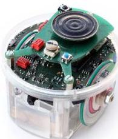
Imagen 1

Nuestro robot va a explorar el entorno en busca de las personas que se encuentran atrapadas, las cuales cada cierto tiempo emitirán una señal de auxilio. Sumada a la búsqueda activa para encontrar a estas víctimas, el robot va a ayudarse de estas señales para localizar sus fuentes y dirigirse hacia ellas. Una vez localizada la víctima, nuestro robot trasladará a la víctima hacia una zona segura fuera de peligro.

Incorporamos otra funcionalidad a nuestro bombero autónomo. Sumada a la búsqueda y rescate, también contamos con la detección de fuego activo, así como también la extinción del mismo. Cualquier rescate será paralizado si se detecta la presencia de un fuego activo.

Nuestro bombero buscará un extintor y se dirigirá hacia el fuego para apagarlo. En esta simulación el fuego se activará de forma periódica tras ser apagado. Entraremos más en detalle más adelante.

Tras tener todo este comportamiento programado, aplicaremos sobre esta base una arquitectura híbrida basada en la resolución de mapas para poder realizar planificaciones sin perder autonomía, robustez, y flexibilidad.

# Descripción del Escenario

El entorno sobre el que nuestro bombero autónomo realizará esta simulación es una representación simplificada del aula B-10 de la ETSIT UPM. En la simulación, únicamente se podrá acceder por una de las dos puertas existentes, y se considerará como zona fuera de peligro cualquier estancia fuera del aula. La distribución de la B-10 se puede observar en la Imagen 2.

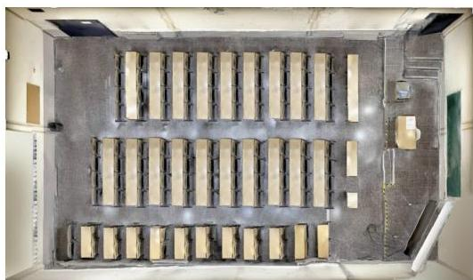
Imagen 2

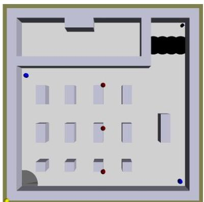
Imagen 3

Sobre este escenario simplificado ilustrado en la Imagen 3 se han añadido varios elementos dinámicos que interactuarán con el robot. En total se pueden distinguir cinco tipos de objetos: luz amarilla, luz azul, luz roja, baldosa de suelo gris y baldosa de suelo negra.

La luz amarilla emula una señal de auxilio de los alumnos que necesitan ser rescatados. Esto lo emulamos encendiendo y apagando la luz durante diferentes intervalos de tiempo mientras el robot bombero busca a los alumnos en peligro. Esta luz amarilla ayuda al bombero a navegar hacia la zona segura manteniéndose encendida hasta que el robot llega a esa zona.

Mientras que la luz azul representa la localización de un extintor, la luz roja representa el fuego que debe ser extinguido. Además, con el objetivo de añadir realismo a la simulación, el fuego se reavivará pasado un tiempo después de que haya sido apagado.

La baldosa de suelo gris representa al alumno. Esta baldosa nos va a ayudar a conocer si el robot ha recogido a un alumno o no, según el estado de la variable “GroundMemory” asociada a este objeto.

La baldosa negra, por otro lado, representa la zona segura, donde el bombero debe llevar a los alumnos rescatados. Al igual que con la baldosa gris, nos fijamos en la variable “GroundMemory” para saber si se ha dejado al alumno en la zona segura.

# Arquitectura Implementada

## Enfoque de la Arquitectura

Para la elaboración de la solución hemos configurado una arquitectura basada en el comportamiento, empleando los principios de subsunción y de esquemas motores.

La arquitectura de subsunción se basa en diferenciar los distintos comportamientos en diferentes módulos y ordenarlos según su nivel de competencia. De esta forma habrá módulos con distintos niveles de prioridad, y al solo poder actuar sobre los actuadores un comportamiento a la vez, prevalecerá el que posea una mayor prioridad. Los niveles de prioridad se asignan empezando desde el nivel '0' en ascenso, y cuanto menor sea el número de nivel, mayor prioridad presenta. Estos módulos son máquinas de estados en la que las salidas son funciones sencillas de las entradas y variables locales. Además, un aspecto fundamental, es que tanto las entradas como las salidas pueden ser inhibidas y suprimidas, consiguiendo de esta forma que los niveles de competencia superiores puedan inhibir a los inferiores.

El principio de esquemas motores se caracteriza por coordinar los distintos módulos que representan distintos comportamientos. Es decir, en vez de que se ejecute únicamente el módulo de mayor prioridad, lo que se va a hacer, a través de un controlador, es ejecutar a la vez diferentes comportamientos para obtener entre otros beneficios, una mayor adaptabilidad al entorno, y una transición más fluida entre comportamientos. De esta manera no sería necesario la implementación de inhibidores.

La arquitectura del proyecto, donde se nota claramente que se implementan ambos principios, se puede observar en la Imagen 4.

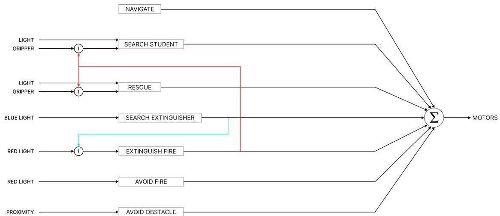
Imagen 4

# Sensores y Actuadores Empleados

El E-Puck va a precisar de un total de cinco sensores para realizar todas sus funcionalidades. El sensor de proximidad será llamado por “Avoid Obstacle”, el de luz amarilla por “Rescue” y “Search Student”, el de luz azul por “Search Extinguisher”, el de luz roja por “Avoid Fire” y “Extinguish Fire”, y el de suelo con memoria lo emplearán “Rescue” y “Search Student”.

Los actuadores empleados serán los motores de las ruedas para hacer que el robot se dirija a la dirección deseada, y los LEDs presentes en el cuerpo del robot.

El LED negro será el color por defecto del E-Puck, el de color rojo se usará cuando se esté evitando atravesar el fuego, el de color verde se empleará cuando se esquive un obstáculo, el de color azul se encenderá cuando se haya cogido un extintor, y el color amarillo se activará cuando el robot bombero haya cogido a un alumno.

# Descripción de los Comportamientos

Para que el robot realice las funciones anteriormente descritas, se han diferenciado distintos comportamientos que se van a ejecutar en función de la información obtenida por los sensores. Los comportamientos son los que siguen.

# Navigate

Este comportamiento siempre va a estar activo, y su función es hacer avanzar al robot en la dirección a la que apunta. Es un comportamiento que va a ser invocado por el resto de funcionalidades que impliquen que nuestro robot se desplace.

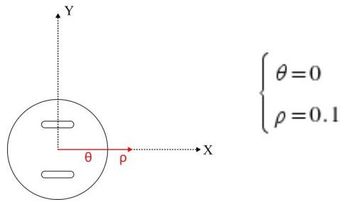

# Search Student

En este comportamiento se hace avanzar al E-Puck hacia la luz amarilla siempre que esta se detecte. Esta se va a detectar cuando la luz amarilla esté encendida, ya que en esta función se va a ir encendiendo y apagando la luz cada ciertos intervalos de tiempo.

Se debe tener en consideración que este comportamiento solo se va a ejecutar siempre que “GroundMemory” esté vacío y el inhibidor fFireInhibitor esté inactivo (a 1). Esto significa que este comportamiento actuará sobre el robot cuando no se haya recogido a un alumno y no se haya detectado fuego.

En definitiva, “Search Student” sirve para buscar a los alumnos, ya que la luz está situada en el mismo sitio que la baldosa gris que representaba a los alumnos.

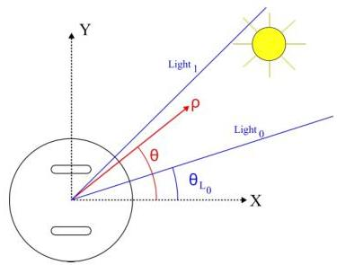

$$
\left\lbrace \begin{array}{l} \theta = \arctan \left( \frac{ \sum_{i=0}^{7} L_i \cdot \sin(\theta_{L_i}) }{ \sum_{i=0}^{7} L_i \cdot \cos(\theta_{L_i}) } \right) \\ \rho = \left\lbrace \begin{array}{l l} 0 \\ \text{Light}_{\text{max}} & \text{if GroundMem = 1 and fFire = 1} \end{array} \right. \end{array} \right.
$$

# Rescue

El comportamiento de “Rescue” es opuesto al de “Search Student”, es decir, cuando se detecta la luz amarilla, el robot se dirigirá en sentido contrario a la dirección de donde proviene la luz en vez de ir hacia ella. Además, cuando esté corriendo esta función permutará el color del LED del E-Puck a amarillo.

“Rescue” únicamente entrará en funcionamiento cuando se haya recogido a un alumno (“GroundMemory” = 1) y no se haya detectado fuego (fFireInhibitor = 1).

Puesto que la zona segura (baldosas negras) está en el lado opuesto a la luz amarilla, podemos afirmar que este comportamiento realiza el rescate de alumnos.

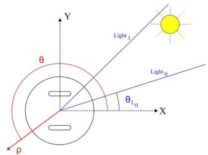

$$
\left\lbrace \begin{array}{l} \theta = \pi - \arctan \left(\frac {\sum_ {i = 0} ^ {7} L _ {i} \cdot \sin \left(\theta_ {L _ {i}}\right)}{\sum_ {i = 0} ^ {7} L _ {i} \cdot \cos \left(\theta_ {L _ {i}}\right)}\right) \\ \rho = \left\lbrace \begin{array}{l l} 0 & \\ 1 - \text{Light}_{\text{max}} & \text{if GroundMem = 1 and fFire = 1} \end{array} \right. \end{array} \right.
$$

## Search Extinguisher

"Search Extinguisher" va a dirigir al robot hacia la luz azul gracias a los valores que captan los sensores de esta luz. Cuando se detecte una intensidad mayor a la de "EXTINGUISH_THRESHOLD", se activará el inhibidor fExtinguisherInhibitor (= 0), lo que significa que se ha recogido un extintor.

Este comportamiento se ejecutará siempre que se haya detectado fuego (fFireInhibitor = 0) y no se haya recogido un extintor (fExtinguisherInhibitor = 1).

Por tanto, concluimos que el comportamiento se basa en buscar y coger un extintor cuando haya fuego y no se tenga uno.

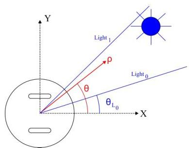

$$
\left\lbrace \begin{array}{l} \theta = \arctan \left(\frac {\sum_ {i = 0} ^ {7} L _ {iBlue} \cdot \sin \left(\theta_ {L _ {i}}\right)}{\sum_ {i = 0} ^ {7} L _ {iBlue} \cdot \cos \left(\theta_ {L _ {i}}\right)}\right) \\ \rho = \left\lbrace \begin{array}{l l} 0 & \\ \text{LightBlue}_{\text{max}} & \text{if fFire = 0 and fExtinguisher = 1} \end{array} \right. \end{array} \right.
$$

## Extinguish Fire

Este comportamiento va a llevar al E-Puck hacia la fuente de luz roja. Si se tiene un extintor (fExtinguisherInhibitor = 0) va a poner el LED de color azul. Siempre que la luz roja está encendida, se detecte una intensidad de esta luz mayor que la de "FIRE_THRESHOLD", y no se haya cogido un extintor, se activará el inhibidor fFireInhibitor (fFireInhibitor = 0) lo que indica que hay fuego.

No obstante, si la luz roja está encendida, si se detecta una intensidad de esta luz mayor que la de "FIRE_THRESHOLD" y si se ha cogido un extintor, se desactivarán los inhibidores fFireInhibitor y fExtinguisherInhibitor además de apagar la luz roja. Esta luz roja se reactivará pasado un tiempo una vez se complete un contador interno, para de esta manera podamos emular un fuego reavivándose.

"Extinguish Fire" entrará en funcionamiento cuando los inhibidores fFireInhibitor y fExtinguisherInhibitor estén activos.

Es decir, si se ha detectado fuego y se tiene un extintor, se irá hacia la luz roja y la apagará. Por consiguiente, este comportamiento apagará el fuego

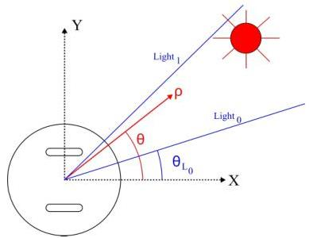

$$
\left\lbrace \begin{array}{l} \theta = \arctan \left( \frac{ \sum_{i=0}^{7} L_{iRed} \cdot \sin(\theta_{L_i}) }{ \sum_{i=0}^{7} L_{iRed} \cdot \cos(\theta_{L_i}) } \right) \\ \rho = \left\lbrace \begin{array}{l l} 0 \\ LightRed_{max}  & \text{if } fFire = 0 \text{ and } fExtinguisher = 0 \end{array} \right. \end{array} \right.
$$

# Avoid Fire

"Avoid Fire" va a alejar el robot de la luz roja a máxima velocidad. Este comportamiento tomará acción cuando la intensidad de luz roja supere el umbral "FIRE_THRESHOLD" + 0.01. Añadimos este umbral de tolerancia mayor al fuego, para evitar el conflicto entre las ejecuciones de "Avoid Fire" y "Extinguish Fire".

Lo que hará esta función es simplemente alejarse de la luz roja que simula el fuego, para que de esta forma la simulación sea lo más fiel posible a la realidad, puesto que no se puede atravesar el fuego.

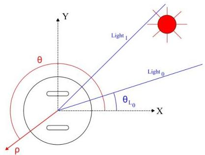

$$
\left\lbrace \begin{array}{l} \theta = \pi - \arctan \left( \frac{ \sum_{i=0}^{7} L_{iRed} \cdot \sin(\theta_{L_i}) }{ \sum_{i=0}^{7} L_{iRed} \cdot \cos(\theta_{L_i}) } \right) \\ \rho = \left\lbrace \begin{array}{l l} 0  & \text{if } LightRed_{max} < FIRE - THRESHOLD + 0.01 \\ 1 & \text{if } LightRed_{max} \geq FIRE - THRESHOLD + 0.01 \end{array} \right. \end{array} \right.
$$

# Avoid Obstacle

"Avoid Obstacle" tiene un comportamiento similar al de "Avoid Fire", solo que en vez de huir de la luz roja, se va a esquivar los obstáculos del entorno. El robot ejecutará este comportamiento cuando la intensidad recogida por los sensores de proximidad supere el umbral "PROXIMIY_THRESHOLD".

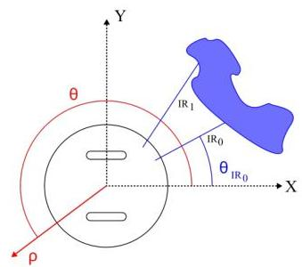

$$
\left\lbrace \begin{array}{l} \theta = \pi - \arctan \left(\frac {\sum_ {i = 0} ^ {7} I R _ {i} \cdot \sin \left(\theta_ {L _ {i}}\right)}{\sum_ {i = 0} ^ {7} I R _ {i} \cdot \cos \left(\theta_ {L _ {i}}\right)}\right) \\ \rho = \left\lbrace \begin{array}{l l} 0 & \text{if } I R _ {max}  <   \text{PROXIMITY} - \text{THRESHOLD} \\ 1 & \text{if } I R _ {max} \geq \text{PROXIMITY} - \text{THRESHOLD} \end{array} \right. \end{array} \right.
$$

# Implementación en el Simulador IRSIM

Para conseguir el funcionamiento clave que aporta dinamismo a la simulación, que es que se puedan encender las luces azules y rojas, ha sido necesario la modificación y creación de diferentes archivos.

Para que existan unas variables que puedan ser modificadas en el controlador de la simulación, y leídas en los objetos de luz, se ha creado un archivo que se sitúa en el directorio principal del simulador y que alberga dos variables, una por cada luz que se tiene que encender y apagar. Estas variables, que son externas tanto al controlador como a los objetos de luz, las configuramos como booleanos. De esta forma, si la variable está activada la luz se enciende, y si, por el contrario la luz debe apagarse.

En los objetos de luz se debe incluir el fichero que se ha creado y cambiar la función "GetTiming" para que devuelva '1' si la luz debe de estar encendida, o '0' en caso contrario.

En el controlador de la simulación también hay que incluir el fichero que se ha creado e inicializar las variables. Más adelante, tanto en el "SimulationStep" como en los distintos comportamientos que hemos visto que modifican el estado de las luces, se modificará el valor de las variables externas según se necesite para encender o apagar las luces.

# Extensión a una Arquitectura Híbrida

Ahora que ya tenemos la arquitectura basada en el comportamiento compilando y ejecutando correctamente todos los comportamientos requeridos, vamos a implementar sobre lo ya desarrollado una arquitectura híbrida basada en la resolución de mapas.

Este tipo de arquitectura va a contar con tres módulos diferenciados.

El primero que va a entrar en acción es el de "Calc Cell". Su función es crear un mapa en el que se va a representar cada celda del entorno. Inicialmente creará un mapa con todas las celdas marcadas como obstáculos, e irá marcando como libre de obstáculo las celdas por las que va

pasando. Si encuentra la zona de partida, que en nuestro caso será una baldosa gris, marcará la celda como “Prey”, y si encuentra el objetivo, en nuestro caso una baldosa negra, lo marcará como “Nest”. Una vez se haya localizado tanto “Prey” como “Nest”, se lo comunicará al siguiente módulo “Path Planning” pasándole el mapa que ha creado. Tras esto, eliminará las posiciones de “Prey” y “Nest”.

“Path Planning” va a crear una copia del mapa recibido y va a calcular la ruta más óptima del “Prey” a “Nest” mediante un algoritmo $A^*$ siempre que no haya ninguna planificación ya realizada. Una vez el algoritmo calcule la ruta, esta se pasará al último módulo. El algoritmo $A^*$ se basa en la implementación mediante nodos, donde se establece un nodo de inicio y uno de final, otro nodo que representará el nodo desde el que se ha llegado (nodo padre), y dos listas, una con los nodos ya visitados que contienen la distancia al nodo inicio, y otra con los nodos por explorar. Los nodos por explorar se ordenan de tal forma que el que tenga la distancia al inicio más baja será el siguiente en ser procesado.

El último módulo, “Go Goal”, recibe la ruta que debe seguir el robot y va a actuar sobre los motores del robot para que este vaya a las posiciones que componen la ruta para que finalmente se llegue al objetivo. Una vez llegado al objetivo se va a intercambiar “Prey” por “Nest”, de tal forma que se vuelva nuevamente a la baldosa gris y así volver a empezar nuevamente.

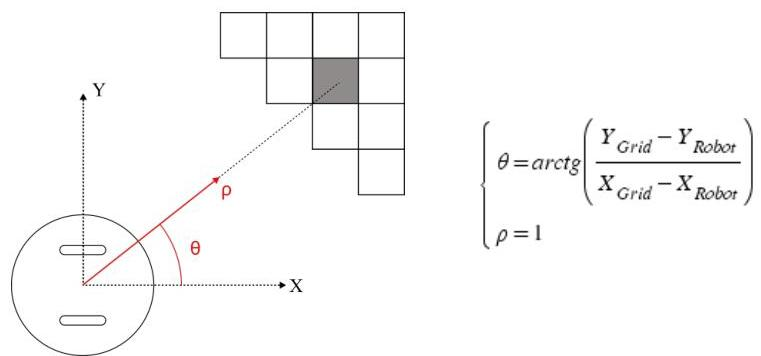

Para la simulación, hemos añadido una función a “Go Goal”, esta es que ponga el LED del E-Puck en amarillo siempre que se haya recogido a un alumno y se le esté llevando a la zona fuera de peligro.

La implementación de esta nueva arquitectura va a necesitar recibir la información de dos sensores. El sensor encoder que lo va a requerir “Calc Cell” para ir marcando qué es cada celda. El de suelo con memoria es el otro sensor que se va a emplear, este lo usarán “Calc Cell” para identificar “Prey” y “Nest”, y “Go Goal” para saber cuándo cambiar se ha recogido a un alumno y así cambiar el color del LED.

La ejecución de esta parte de resolución de mapas será inhibida siempre que se detecte fuego ($f_{\text{FireInhibitor}} = 0$), puesto que apagar el fuego debe ser prioritario como ya mencionamos con anterioridad.

Mientras el robot esté recorriendo la ruta planificada, se activará el inhibidor fGoalToInhibitor hasta que se llegue al destino. Este inhibidor afectará a los módulos de “Rescue” y “Search Student”, puesto que estará realizando sus comportamientos de forma automática dependiendo únicamente de las celdas ya recorridas, o dicho de otra forma, del conocimiento que se tiene sobre la arena.

La forma en la que afectan estos inhibidores se puede ver en la arquitectura final que adquiere el proyecto tras aplicarle la arquitectura híbrida (Imagen 5).

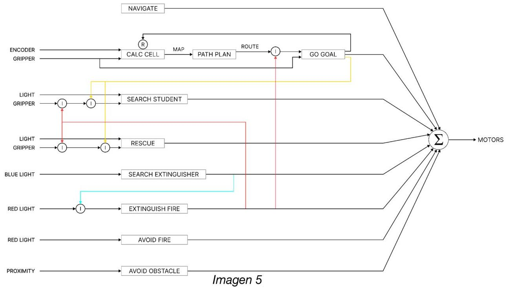

# Resultados de la Simulación

Con el objetivo de verificar que el robot sigue el comportamiento esperado, vamos a analizar la activación de cada módulo, en función de la información recogida por los sensores.

Para ello, vamos a representar sobre una línea temporal la información de los sensores de proximidad, luz amarilla, luz azul, luz roja y suelo con memoria, la información sobre el estado de los objetos de luz dinámicos (amarillo y rojo), y los inhibidores, y la activación de los distintos comportamientos.

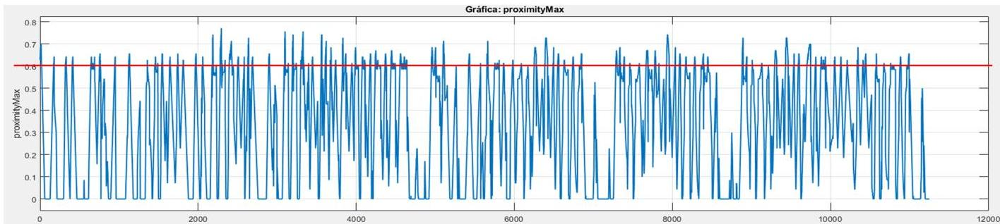

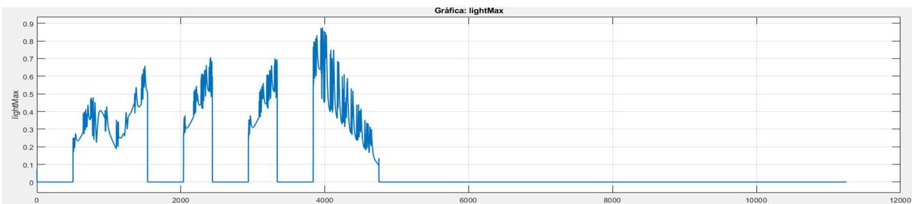

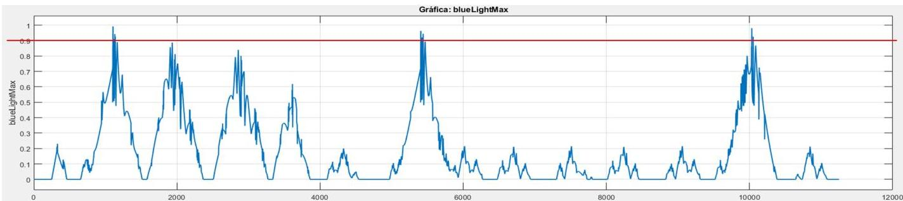

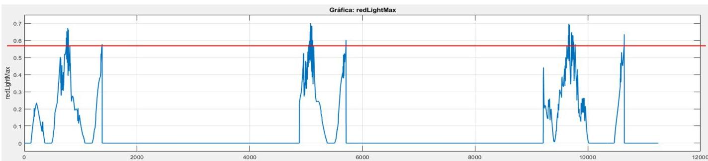

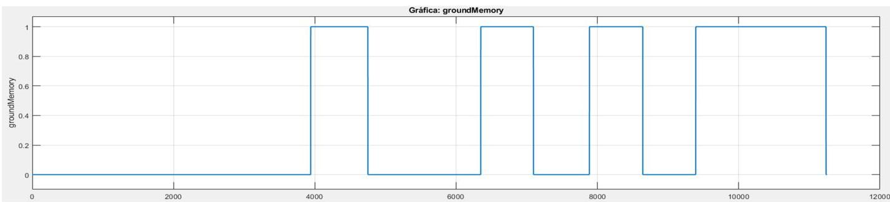

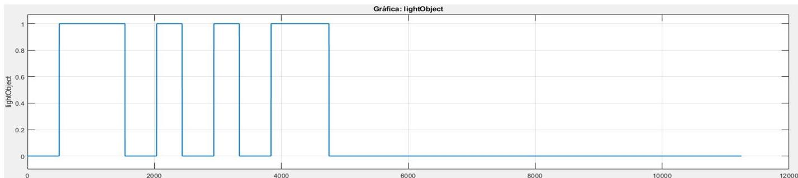

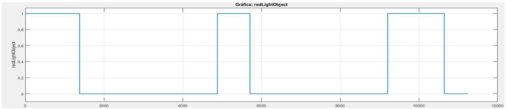

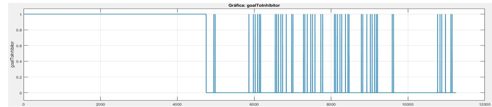

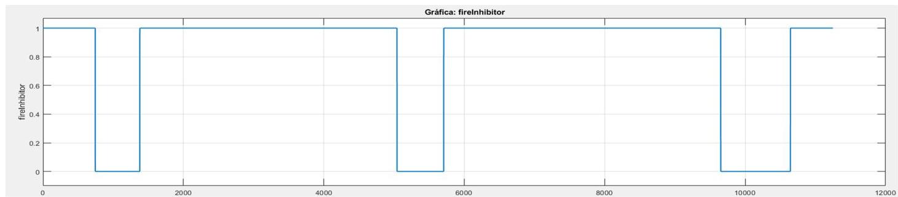

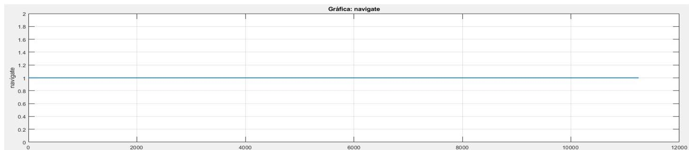

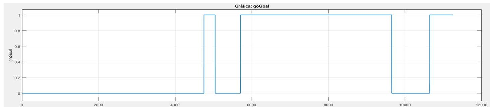

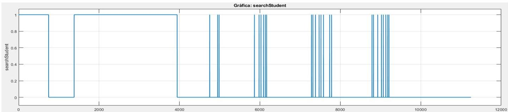

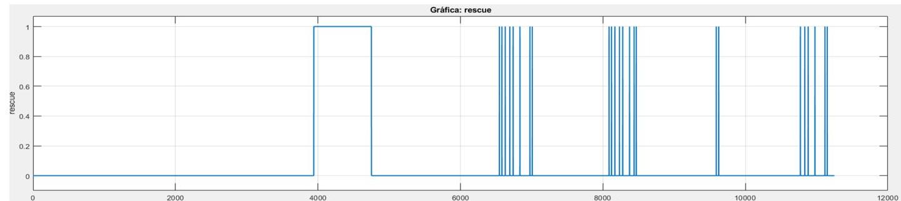

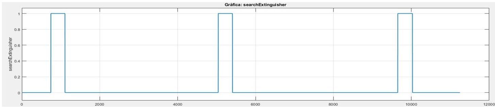

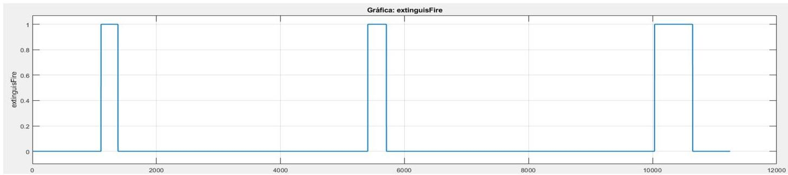

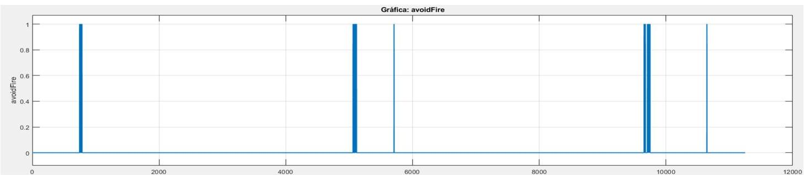

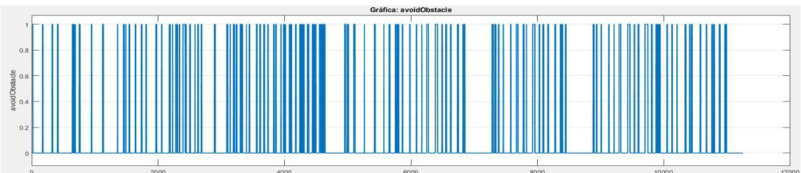

Tras observar todas las gráficas que se han formado tras un tiempo de ejecución de un minuto y treinta segundos, podemos comprobar que efectivamente el E-Puck sigue el comportamiento esperado.

Otro análisis que resulta interesante estudiar y comparar es el recorrido que realiza el robot en los comportamientos “Search Student”, “Rescue” y “Go Goal” para comprobar la efectividad de la planificación de rutas implementada.

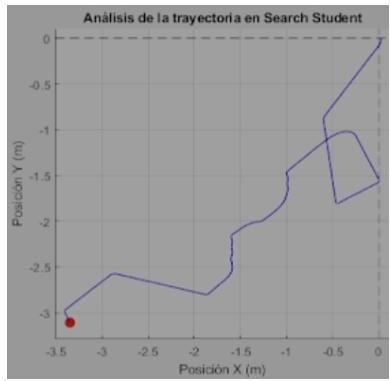
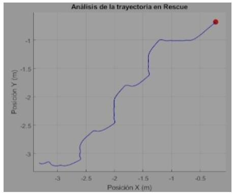
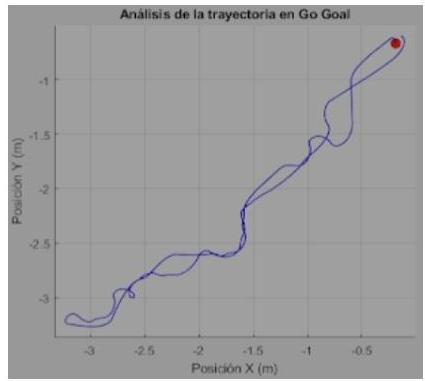

En este segundo análisis se ha planteado una situación ideal en la que no se interrumpe el comportamiento como consecuencia del fuego. El resultado de este análisis muestra claramente que el recorrido realizado por “Go Goal” tanto para buscar a un alumno como para rescatarlo es más óptimo. Esto es más notable en la búsqueda del alumno puesto que “Search Student” depende de que el alumno pida auxilio mientras que “Go Goal” ya lo tiene localizado. Otro aspecto en el que también supera “Go Goal” a “Search Student” y a “Rescue” es en el tiempo que tarda en completarse el comportamiento, siendo claramente mayor en estos dos últimos.

# Conclusiones

Como se puede ver en el apartado anterior, hemos conseguido modelar exitosamente el comportamiento del robot bombero autónomo que propusimos al comienzo de la práctica.

Esto supone que el proyecto se podría escalar a un entorno real, con unos sensores y actuadores más avanzados tanto en la recogida como en la detección de personas en situación de peligro por incendio. Pudiéndose en un futuro implementar en los servicios de emergencias si sigue cumpliendo con las especificaciones y comportamientos exigidos.
